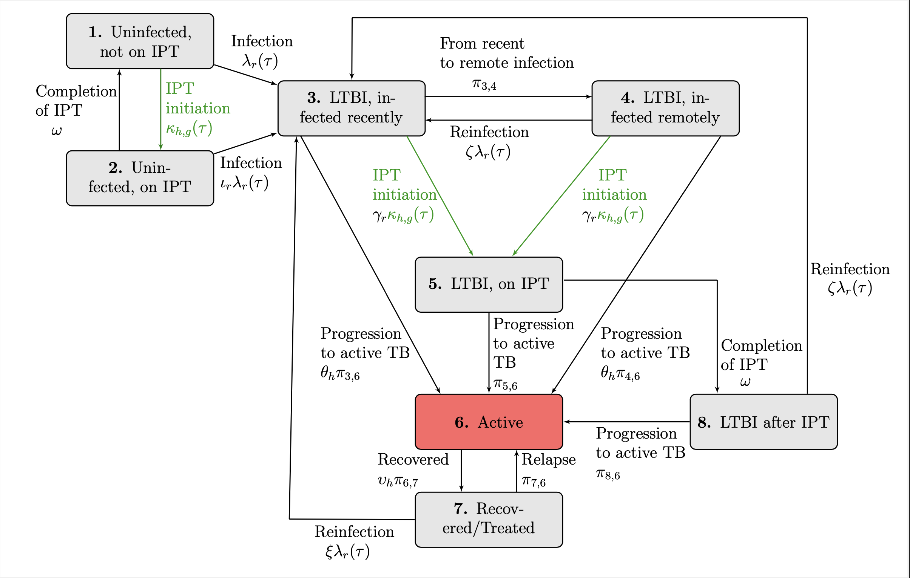
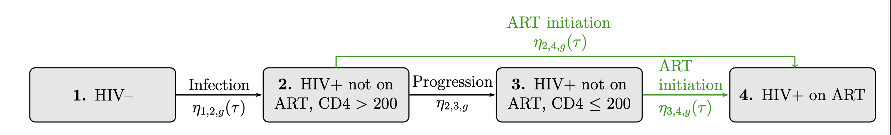

## Preventing tuberculosis with community-based antiretroviral therapy (ART) and tuberculosis preventive therapy (TPT) care in Kwazulu-Natal, South Africa: a dynamic transmission modeling analysis
=======
The details for the model are provided in the [appendix](https://github.com/cgreene3/dynamic_transmission_model_HIV_TB_KZN_SA/blob/master/documentation). The description of what is included the repository is provided below.

##This work is available as a pre-print
Ross, J.M., Greene, C., Bayer, C., Dowdy, D., van Heerden, A., Heitner, J., Rao, D.W., Roberts, D.A., Shapiro, A.E., Zabinsky, Z.B. and Barnabas, R.V., 2023. Preventing tuberculosis with community-based care in an HIV-endemic setting: a modeling analysis. medRxiv, pp.2023-08.

### Contents in the repository:
1. [About the Model](#about)
2. [Description of Parameter Files](#parameter_files)
3. [Descriptions of Model Execution Files](#model_execution)
4. [Description of Results Files](#results)

#### About the Model 
This repository contains the files needed to execute a dynamic transmission model for tuberculosis (TB) and human immunodeficiency virus (HIV) disease progression that is compartmentalized by TB stage, HIV stage, TB and HIV treatment status, TB drug resistance status, and gender. The model is set up to evaluate the impacts of increased uptake of antiretroviral therapy (ART) and isoniazid preventive therapy (IPT) observed in the community-based intervention of the Delivery Optimization for Antiretroviral Therapy (DO ART) trial, compared to standard, facility-based ART and IPT care. The model projects health outcomes, including TB incidence, TB mortality, TB and HIV prevalence. 

<figure>
  <figcaption> **TB Transitions** </figcaption>
  
</figure>
<figure>
  <figcaption> **HIV Transitions** </figcaption>
  
</figure>
Above is an illustration of the rates of flow for the TB and HIV dynamic transmission model. Rates of flow between each compartment are governed by differential equations, as described in the appendix. Although not visualized here, each TB and HIV compartment is stratified across two TB drug-resistance categories, and two genders. The latent TB infection (LTBI) compartment is distinguished by those infected within two years, considered recent, and more than two years, considered remote.  Although not visualized, individuals can age into TB compartments 1 (uninfected, not on IPT), 3 and 4 (LTBI, recent and remote), and 6 (active TB), and HIV compartments 1 (HIV-) and 2 (HIV+, not on ART, CD4 > 200) and can age-out or die from any compartment. The rate of IPT and ART initiations (highlighted in green) are directly impacted by care delivery programs. The active TB compartment is highlighted in red to emphasize the compartment capturing incident TB cases and TB mortality. TB incidence rates are calculated based on the number of individuals transitioning into the active TB compartment. TB mortality rates are calculated based on the number of individuals dying in the active TB compartment.

#### param_files (folder) 
the param_files folder contains raw input data and scripts used to generate calibration sets and input data (when generated from multiple sources). A detailed description of parameters are described in Section 5 of the appendix.

* **calculated_param_gen (folder)** this folder uses the data in the raw_input_data (folder) and scripts to generate input parameters including: calibration sets from ranges; dynamic parameters generated from multiple sources including (baseline non-disease mortality rates), HIV incidence rates, birth proportions; initial population states; and program specific parameters (ART coverage and IPT initiation)
  * **raw_input_data (folder)** this folder contains raw input data sources from GBD, DOART, and the parameters listed in Table 5 in Section 5.2 in the appendix as in *KZN_SA_model_parameters.xlsx*.
  * *1_pop_estimates_calc.R (script)*: this script is used to generate population estimates for males and females in Kwazulu-Natal South Africa between the ages of 15 and 59 and 10 to 15 using GBD data. The many of the parameter generation scripts use population estimates so you should run this script first. Outputs are written to the /param_files/calculated_param_gen/raw_input_data/GBD (folder) 
  * *2_base_mort_rate_gen.R (script)*: this script is used to generate baseline mortality rates for the years between 1990 and 2017 for males and females in Kwazulu-Natal South Africa between the ages of 15 and 59 using GBD data. In the dynamic transmission model we use baseline mortality rate estimates from 1990 for any years prior to 1990, and estimates from 2017 for any years after 2017. Details are described in Section 5.2.2 in the appendix. Data outputs are written to the /param_files/input_parameters (folder), visualization of baseline mortality rates are written to /param_files/dynamic_param_graphs
  * *3_hiv_incidence_rate_gen.R (script)*: this script is used to generate HIV incidence rates for the years between 1980 and 2027 for males and females in Kwazulu-Natal South Africa between the ages of 15 and 59 using GBD data and DO ART data (on the projected annual rate of change of HIV incidence rates under facility-based ART and community-based IPT from 2018 to 2027). Details are described in Section 5.2.1 in the appendix. Data outputs are written to the /param_files/input_parameters (folder), visualization of baseline mortality rates are written to /param_files/dynamic_param_graphs
  * *4_births_perc_overtime_and_pop_init_calc.R (script)*: this script is used to generate initial population estimates in 1940 and the proportion of births into each compartment. Details are described in Section 5.1 in the appendix. 
  * *5_ipt_initiation_calc.R (script)*: this script is used to generate IPT initiation values between 2005 and 2027 for each program. Details are described in Section 5.3.2 in the appendix. Outputs are written to the /param_files/input_parameters (folder)
  * *6_ART_prop_eligible_gen.R (script)*: this script is used to generate the proportion of those in HIV compartment 2 (HIV+, not on ART, CD4 > 200) eligible to initiate ART between 2011 and 2015 based on findings from the DO ART study. Outputs are written to the /param_files/input_parameters (folder)
  * *7_ART_coverage_calc.R (script)*: this script is used to generate ART coverage values between 2004 and 2027 for each program. Details are described in Section 5.3.1 in the appendix. Outputs are written to the /param_files/input_parameters (folder)
  * *8_target_param_gen.R (script)*: this script is used to generate target calibration ranges from GBD estimates. Outputs are written to the /param_files/target_calibration_estimates (folder).
  * *9_sample_gen.R (script)*: this script is used to generate the 100,000 parameter sets used in calibration using Latin hypercube sampling. Outputs are written to the /param_files/input_parameters (folder)
  * *a_accepted_calib_points_distribution_gen.R (script)*: this script is used to generate histograms to evaluate distribution of accepted parameter sets (after running the calibration). Outputs are written to the /param_files/distribution_of_accepted_points_graphs (folder)
    
* **distribution_of_accepted_points_graphs(folder)** histograms to evaluate distribution of accepted parameter sets (after running the calibration) 

* **dynamic_param_graphs (folder)** visualization of mean HIV incidence and baseline mortality rates

* **input_parameters (folder)** contains all the input parameters used in the dynamic transmission model as described in Section 5.1 to Section 5.3 in the appendix, as well as the 100,000 parameter sets generated using Latin hypercube sampling for calibration:
  * *art_coverage_df.csv*, ART coverage for males and females starting (for each program during the intervention period) 
  * *art_prop_eligible_df.csv*, The proportion of those in HIV compartment 2 (HIV+, not on ART, CD4 > 200) eligible to initiate ART between 2011 and 2015 based on findings from the DO ART study. 
  * *base_mort_df.csv*, baseline (non-disease) mortality rates for males and females
  * *birth_perc_df_overtime.csv*, The proportion of individuals aging into the model into each compartment by year.
  * *calibration_sets_df.csv*, 100,000 calibration sets generated with Latin hypercube sampling
  * *hiv_inc_df.csv*, HIV incidence rates for males and females (by facility-based and community-based programs during the intervention period)
  * *ipt_initiation_df.csv*, IPT initiation for males and females starting (for each program during the intervention period) 
  * *pop_init_df_1940.csv*, Initial population states in 1940

* **target_calibration_estimates (folder)** target calibration ranges are generated using the script */param_files/calculated_param_gen/8_target_param_gen.R*, the script generates target calibration ranges for:
  * HIV prevalence rates for males and females:
    * *KZN_GBD_HIV_prev_rate_calibration_df.csv*
  * TB incidence rates for males and females by HIV-status (HIV negative and positive)
    * *KZN_GBD_TB_inc_rate_calibration_df.csv*
  * TB mortality rates for males and females by HIV-status (HIV negative and positive)
    * *KZN_GBD_TB_mort_rate_calibration_df.csv*

* **distribution_of_accepted_points_graphs (folder)** contains histogram of accepted parameter distribution for all 35 calibrated parameters

#### model_execution (folder) 
The model execution file contains the code to run the calibration period, intervention period and relevant files for hyak. Description of how the model is executed can be found in Section 3 of the appendix. 

* **calibration_period** Description of the calibration and results can be found in Section 5.4 of the appendix. 
  * *warmup_calibration_for_loop_Rscript.R (script)* used to run a specified range of calibration sets from the start of 1940 to end of 2017. The code is set up to run on hyak as well as locally, however the code can only only be run at scale for all 100,000 parameter sets generated for calibration on Hyak. The code generates model values for each parameter set used in calibration. We store the outputs for the 100,000 on Hyak, due to storage constraints. Example outputs can be seen at *'/test/calibration_outputs'*
  * *calibration_analysis_Rscript.R (script)* used to evaluate model values for each parameter set for metrics used in calibration against target calibration ranges. The script generates the list of accepted parameter sets, model values for metrics used in calibration for each of the accepted parameter sets. Since we run the code on Hyak outputs are saved to a file called calibration_analysis then we copy outputs into */results/calibration_analysis*.
  
* **intervention_period**
  * *program_runs_for_loop_Rscript.R (script)* used to run accepted parameter sets from the start of 1940 to the end of 2017 under Program 1 then for program from the start of 2018 to the end of 2027. The script outputs the metrics in Section 4.1 to Section 4.3 in the appendix for each program, and state and transition files for use in the cost model and economic evaluation.  Since we run the code on Hyak outputs are saved to a file called program_outputs and program_outputs_economic_analysis. Then we copy the program outputs into */results/program_outputs*. 
  * *program_analysis_Rscript.R (script)* used to generate graphs used to analyse program heath outcomes. While we can run the script on Hyak, its small enough to run locally with the results stored in */results/program_outputs*. The code generates stats used in the results section to analyse health outcomes for each program to */results/stats* and graphs to */results/graphs*
  
* **hyak**
  * Contains the containers needed to make image files, and batch scripts used to run the image files on hyak and,
  * instructions (folder) describes how to make an image file with command line on hyak, and the organization of the hyak folder where we run all the files from.
  
* **cost_model**
  * program_outputs_economic_analysis are saved to a seperate repository used for the cost model, DALYs and to calculate incremental health gains and costs. 

#### results (folder) 
The results folder contains the results listed below. There is a test folder that is used to gather results of outputs for calibration and intervention period runs.

* *stats (folder)* contains csv files that describe stats used in the section to analyse health outcomes for each program
* *program_outputs (folder)* contains csv files that provide the metrics in Section 4.1 to Section 4.3 for the years 1990 to 2017 under program 1 and for each program over the years in the intervention period from 2018 to 2027 for each of the accepted parameter sets
* *graphs (folder)* 
  * *calibration (folder)* contains graphs for calibration by measure, hiv status (when applicable), and gender
  * *calibration 2 (folder)* contains graphs for calibration by measure and gender. Both HIV status results are seperated but provided on a single graph. 
  * *program (folder)* contains graphs for TB incidence and mortality rates by hiv status (when applicable), and gender
  * *program2 (folder)* contains graphs for TB incidence and mortality rates by gender. Summed over HIV-status. 
  * *program 3 (folder)* TB incidence, TB prevalence and TB mortality rates (per 100,000 individuals). For appendix.
  * *program 3 (folder)* TB incidence, TB prevalence and TB mortality rates (per 100,000 individuals). For manuscript.
